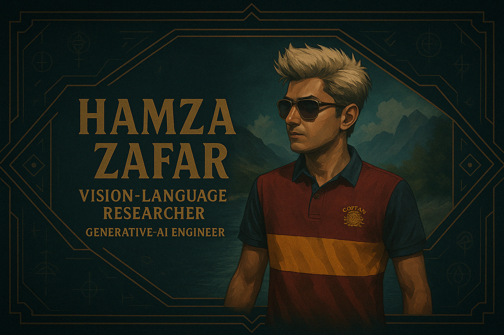

  

### 💼 About me  
Senior software engineer and vision‑language researcher focused on generative models, multimodal transformers and scalable AI systems. Currently completing an Erasmus Mundus M.Sc. at NTNU while leading backend and ML work at Receptive AI. 

### 🔭 Research & engineering interests  
- Multimodal transformers for perception and retrieval  
- Diffusion and latent‑generative models  
- Real‑time inference pipelines & micro‑service architectures  
- Cloud infrastructure on AWS / Kubernetes  

### 🚀 Selected projects  
- **LVMs** – self‑supervised vision‑language models for robotics (2024)  
- **Semantic Image Retrieval** – natural‑language image search demo (2024)  
- **Receptive AI** – GPT‑powered employee‑feedback platform (> $1 M ARR)  
- **Visual Assistant** – on‑device object‑detection mobile app

### 🛠️ Tech stack  
 
 
 
 
 
 
 
 

### ✉️ Contact  
 
 
 

